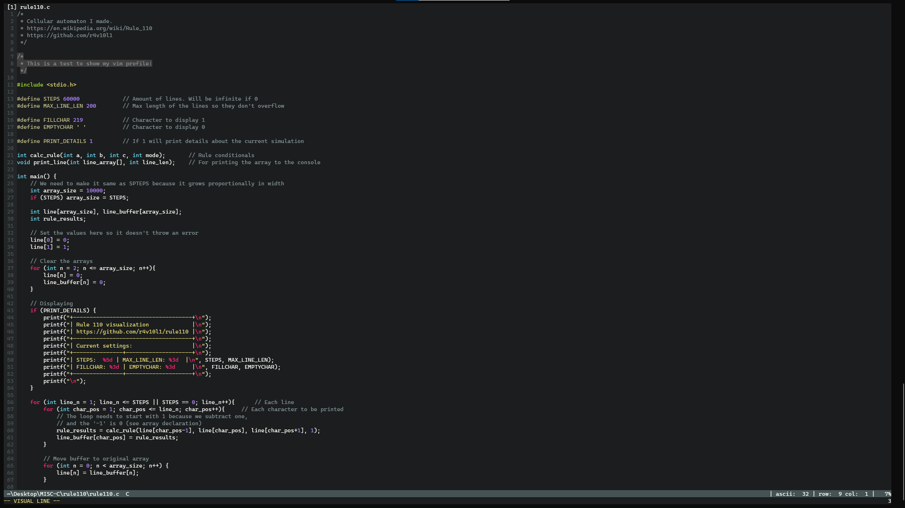

# VIM AND NVIM DOTFILES
**My vim/nvim dotfiles.**

## Installation
### Linux
Copy the `.vim` folder and the `.vimrc` to the user folder (`~`).  
Copy the `init.vim` file to `~/.config/nvim/init.vim`

### Windows
Make sure you use the `vimrc` inside the [windows folder](https://github.com/r4v10l1/vim-dotfiles/blob/main/windows/vimrc) because the linux one will try to download the plugins in every folder you execute vim (`~` is not a thing in windows).  
If you use [cmder](https://cmder.net/), use you should check my settings [here](https://github.com/r4v10l1/cmder-dotfiles).

## Screenshots

