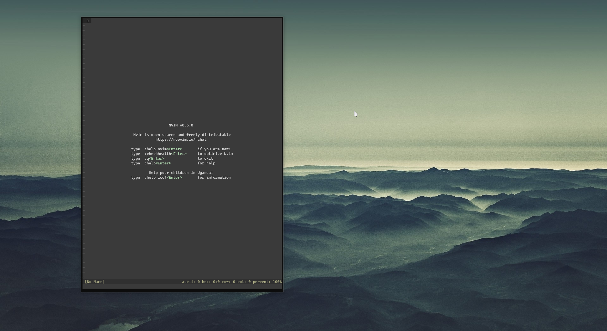
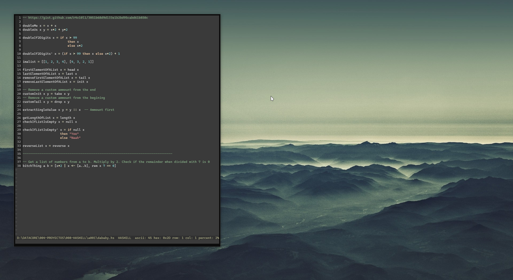
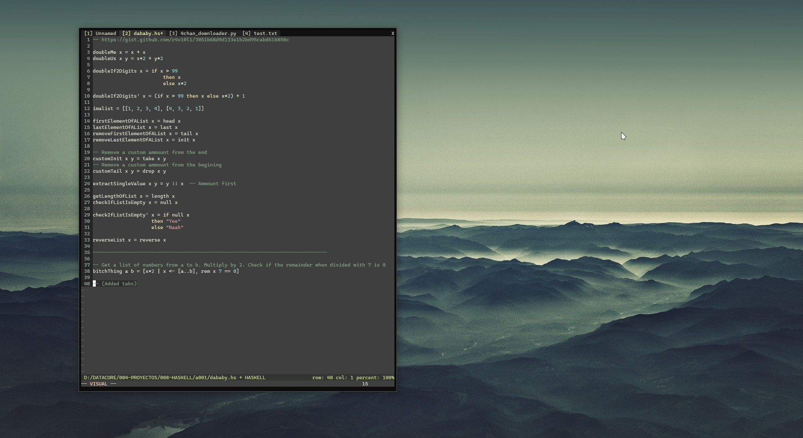

## **VIM AND NVIM DOTFILES**
**My nvim dotfiles.**

Files for windows and linux or some shit idk
#
### Linux
:^)

#
### Windows
Edit lines **81** and **85** from `windows-terminal-settings.json`

#
### Screenshots

